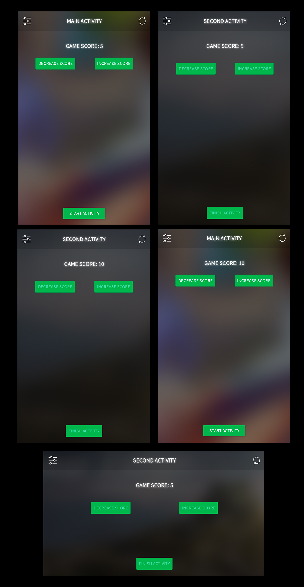

# Maintaining State

A simple application using lifecycle methods to maintain state between configuration changes

# Implementations

## Maintaining state between configuration changes
### 1. Passing data between Activities through Intents
### 2. Passing back data from current activity to activity in back stack
### 3. Store important information when user presses the back button
### 4. SharedPreferences used to store and maintain same Theme until user refresh

# Screenshots

